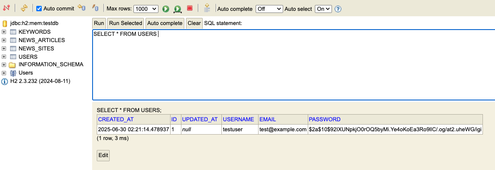

# News Data Collect Service

Spring Boot 기반의 뉴스 데이터 수집 서비스입니다. 네이버 뉴스와 구글 뉴스를 대상으로 키워드 기반 뉴스 기사를 자동으로 수집하고 저장합니다.

## 주요 기능

### 뉴스 수집
- **네이버 뉴스**: JSoup 기반 크롤링으로 본문 수집
- **구글 뉴스**: RSS 피드 + 셀레니움 기반 리다이렉트 처리로 본문 수집
- **키워드 기반 검색**: 사용자가 등록한 키워드로 자동 뉴스 수집
- **스케줄링**: 주기적인 뉴스 수집 자동화

### 사용자 관리
- 사용자 회원가입/로그인 (JWT 토큰 기반 인증)
- 키워드 관리 (등록/수정/삭제)
- 뉴스 사이트 관리

### API 엔드포인트
- RESTful API 제공
- 뉴스 기사 조회 (페이지네이션 지원)
- 실시간 뉴스 수집 요청

## 기술 스택

- **Backend**: Spring Boot 3.x, Spring Security, Spring Data JPA
- **Database**: H2 Database (개발용)
- **Web Scraping**: JSoup, Selenium WebDriver
- **Build Tool**: Gradle
- **Authentication**: JWT

## 요구사항

- Java 17 이상
- Chrome 브라우저 (셀레니움 크롤링용)

## 설치 및 실행

### 1. 프로젝트 클론
```bash
git clone <repository-url>
cd NewsDataCollectService
```

### 2. 애플리케이션 실행

#### 방법 1: Gradle을 통한 직접 실행
```bash
./gradlew bootRun
```

#### 방법 2: JAR 파일로 빌드 후 실행

* 이미 첨부된 jar 파일을 사용하여 JAR 파일 실행 가능
  * (0.0.1 version release)[https://github.com/melonicedlatte/NewsDataCollectService/releases/tag/0.0.1] 버전 다운로드 링크

##### JAR 파일 실행
```bash
java -jar build/libs/NewsDataCollectService-0.0.1-SNAPSHOT.jar
```

파일이 없으면 아래의 명령어를 통하여 빌드 가능 

##### JAR 파일 빌드
```bash
# 전체 빌드 (테스트 포함)
./gradlew build

# 테스트 제외하고 빌드 (빠른 빌드)
./gradlew build -x test
```

빌드가 성공하면 `build/libs/` 디렉토리에 JAR 파일이 생성됩니다.

##### JAR 파일명 확인
```bash
ls -la build/libs/
```

생성되는 파일:
- `NewsDataCollectService-0.0.1-SNAPSHOT.jar` (실행 가능한 JAR)
- `NewsDataCollectService-0.0.1-SNAPSHOT-plain.jar` (의존성 제외 JAR)

### 3. 접속 확인
- 애플리케이션: http://localhost:8080
- H2 콘솔: http://localhost:8080/h2-console

## API 사용법

### 1. 사용자 등록
```bash
curl -X POST http://localhost:8080/api/users/register \
  -H "Content-Type: application/json" \
  -d '{
    "username": "testuser",
    "password": "password123"
  }'
```

### 2. 로그인
```bash
curl -X POST http://localhost:8080/api/users/login \
  -H "Content-Type: application/json" \
  -d '{
    "username": "testuser",
    "password": "password123"
  }'
```

### 3. 키워드 등록
```bash
curl -X POST http://localhost:8080/api/keywords \
  -H "Authorization: Bearer <JWT_TOKEN>" \
  -H "Content-Type: application/json" \
  -d '{
    "keyword": "AI"
  }'
```

### 4. 뉴스 수집 시작
```bash
curl -X POST http://localhost:8080/api/news-collection/start \
  -H "Authorization: Bearer <JWT_TOKEN>"
```

### 5. 뉴스 기사 조회
```bash
curl -X GET "http://localhost:8080/api/news-articles/user/1?page=0&size=10" \
  -H "Authorization: Bearer <JWT_TOKEN>"
```

## 프로젝트 구조

```
src/main/java/com/melllon/newsdatacollectservice/
├── config/                 # 설정 클래스
├── controller/            # REST API 컨트롤러
├── dto/                   # 데이터 전송 객체
├── entity/                # JPA 엔티티
├── exception/             # 커스텀 예외
├── repository/            # 데이터 접근 계층
├── scheduler/             # 스케줄링
├── service/               # 비즈니스 로직
│   └── crawler/          # 뉴스 크롤러
└── util/                  # 유틸리티
```

## 크롤링 아키텍처

### 네이버 뉴스 크롤러
- **방식**: JSoup 기반 정적 크롤링
- **URL**: `https://search.naver.com/search.naver?query={keyword}&where=news`
- **특징**: 빠른 속도, 안정적인 본문 추출

### 구글 뉴스 크롤러
- **방식**: RSS 피드 + 셀레니움 리다이렉트 처리
- **URL**: `https://news.google.com/rss/search?q={keyword}&hl=ko&gl=KR`
- **특징**: 리다이렉트 URL 처리로 실제 기사 본문 수집

## 데이터베이스 스키마

### 주요 테이블
- `users`: 사용자 정보
- `keywords`: 검색 키워드
- `news_sites`: 뉴스 사이트 정보
- `news_articles`: 수집된 뉴스 기사

## 크롤링 후 DB 상태 

애플리케이션 실행 후 뉴스 크롤링이 완료되면 다음과 같은 데이터베이스 상태를 확인할 수 있습니다.

### 1. 사용자 테이블 (users)


### 2. 키워드 테이블 (keywords)


### 3. 뉴스 사이트 테이블 (news_sites)


### 4. 뉴스 기사 테이블 (news_articles) - 전체 조회


### 5. 뉴스 기사 테이블 (news_articles) - 상세 조회


## 스케줄링

- **기본 설정**: 매일 오전 9시 자동 뉴스 수집
- **수동 실행**: API를 통한 즉시 수집 요청 가능
- **키워드별**: 등록된 모든 키워드에 대해 순차 처리

## 보안

- JWT 토큰 기반 인증
- 비밀번호 해싱 (BCrypt)
- API 엔드포인트 보호

## 문제 해결

### 셀레니움 관련
- Chrome 브라우저가 설치되어 있는지 확인
- ChromeDriver 버전 호환성 확인

### 크롤링 실패
- 네트워크 연결 상태 확인
- 대상 사이트의 HTML 구조 변경 여부 확인

## 향후 개선 및 발전 방향

### 1. 크롤러 확장성
- **다음(Daum) 및 기타 포털 지원**  
  현재는 네이버와 구글만 지원하지만, Daum 등 다양한 포털 뉴스 사이트에 대한 크롤러를 추가하여 더 많은 뉴스 소스를 확보할 수 있습니다.  
  크롤러 인터페이스를 표준화하여 손쉽게 새로운 사이트를 추가할 수 있도록 구조 개선이 필요합니다.

### 2. 데이터베이스 확장
- **H2 → MySQL/PostgreSQL 등 실제 DB로 전환**  
  개발 환경에서는 H2를 사용하지만, 운영 환경에서는 MySQL, PostgreSQL 등 영구 저장이 가능한 RDBMS로 전환하여 데이터 유실을 방지합니다.
- **대용량 데이터 저장 구조 개선**  
  다양한 키워드와 대량의 뉴스 데이터를 저장할 때 RDB 단일 테이블로는 한계가 있으므로, 아래와 같은 옵션을 사용하여 성능 향상을 생각해볼 수 있을 것 같습니다.
  - 샤딩(Sharding) 적용  
  - MongoDB 등 NoSQL 도입  
  - 데이터 파티셔닝  

### 3. 크롤링 효율화
- **구글 뉴스 크롤링 최적화**  
  현재 구글 뉴스는 셀레니움을 사용하지만, 아래의 선택지들을 사용하여 효율성과 안정성을 높일 수 있습니다.
  - 더 빠르고 가벼운 브라우저로 대체  
  - 기사 본문 추출 로직 개선  
  - 크롤링 실패/차단 대응 로직 추가  
  
- **셀레니움 리소스 최적화**  
  셀레니움이 CPU를 많이 사용하는 문제를 해결하기 위해 아래의 선택지들을 고려할 수 있습니다.
  - 크롤링 동시 실행 개수(batch 수) 제한  
  - 서버 스펙 업그레이드  
  - 경량 브라우저 도입  

### 4. 사이트 성능 개선
- **경량 브라우저 도입**  
  크롬보다 더 가벼운 브라우저를 도입하여 리소스 사용량을 줄이고, 더 많은 크롤링 작업을 동시에 처리할 수 있도록 개선합니다.
- **비동기/병렬 처리**  
  크롤링 작업을 비동기/병렬로 처리하여 전체 수집 속도를 높입니다.

### 5. CI/CD 및 배포 자동화
CI/CD 에는 여러 툴이 사용되지만, 많이 사용되는 Github Actions 를 채택한다고 가정했습니다.
- **Github Actions 기반 자동화**  
  - 코드 커밋 시 자동 빌드 및 테스트 실행  
  - 테스트 실패 시 마스터 브랜치 병합 차단  
  - 빌드 성공 시 자동 배포(예: Docker 이미지 빌드 및 배포, 클라우드 서버 배포 등)
- **테스트 코드 강화**  
  - 크롤러, API, 서비스 레이어 등 각 계층별 테스트 코드 작성  
  - 크롤링 결과의 신뢰성 검증 자동화

### 6. 추가 고려사항
- **에러/예외 모니터링**  
  Sentry, Slack, 이메일 등으로 크롤링 실패/에러 실시간 알림 후 빠른 조치 및 에러 인지
- **데이터 대시보드**  
  수집 현황, 에러 로그, 키워드/사이트 관리 등 웹 기반 관리자 페이지 제공
- **뉴스 본문 요약/분석 기능**  
  자연어 처리(NLP) 기반 요약, 감성 분석, 키워드 추출 등 부가 기능 추가
- **뉴스 처리량 확인**  
  크롤링하는 사이트에 요청이 너무 많으면 크롤링이 막힐 수 있기 때문에, 적절한 빈도로 나누어 스케줄 빈도를 설정해야 한다.
- **환경 별 yml 설정**  
  필요에 따라 stage, prod 등 yml 파일을 설정하여 별도로 설정합니다.
- **구글 크롤러 로직 개선**  
  불필요한 태그나 광고 관련 데이터들을 삭제하기 위하여 좀 더 정제 과정을 거쳐야 함.